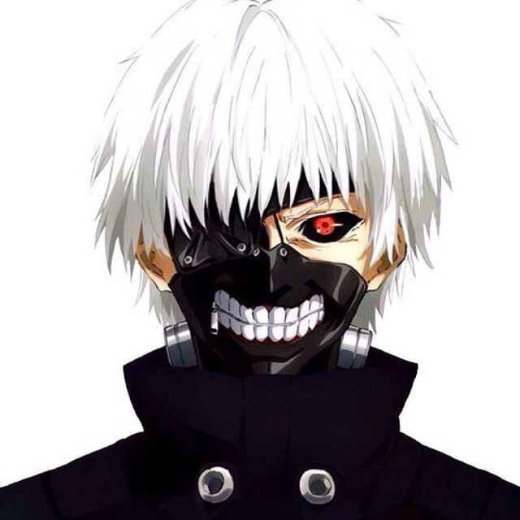

Hey !! 

I am npyl	; 
I am a Computer Engineering student at <a href="https://www.ceid.upatras.gr/">CEID</a>, University of Patras, Greece,
and this is what I know:

### Languages
- C/C++
- Objective-C
- Java
- Some Python
- Less Swift
- ...

### Tools
- Xcode
- CLion

### Contact

<i>(Remove space between pylarinos and nick):</i> 
pylarinos nick AT gmail DOT com 
<a href="https://twitter.com/npyl_cheated?ref_src=twsrc%5Etfw" class="twitter-follow-button" data-show-count="false">Follow @npyl_cheated</a> 

 

### Donate / Support

 
 
<a href="https://www.patreon.com/bePatron?u=11783784" data-patreon-widget-type="become-patron-button">Become a Patron!</a>

 
 
<a>PS: This is not me, this is just Kaneki</a>

 
 
