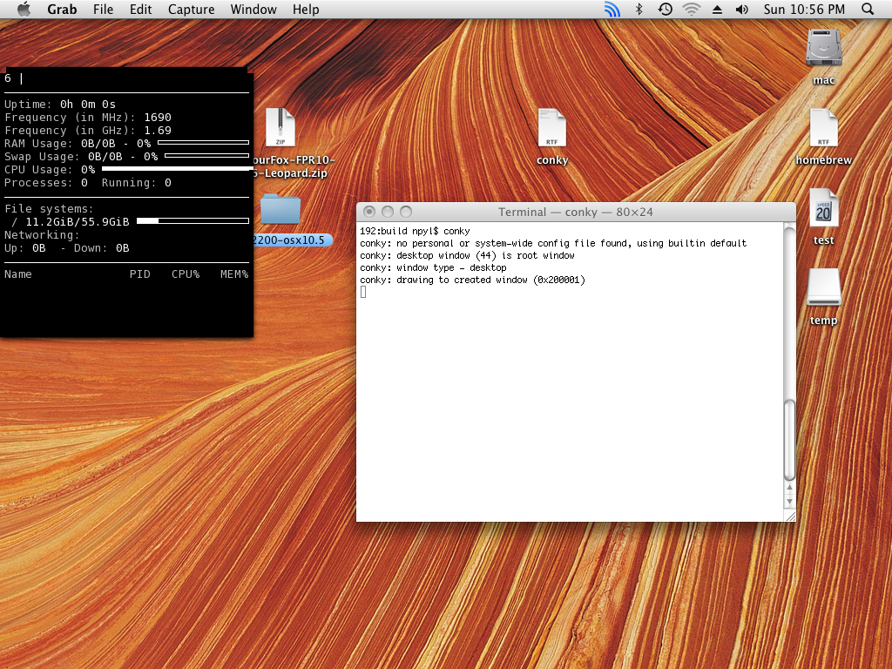

*What if I told you I still like to tinker with Leo?*

I'm currently installing OS X Leopard 10.5.2 on an old 2003 [Dell Latitude D505](https://www.cnet.com/products/dell-latitude-d505/specs/).  Can you believe it? This lappy still works... I only had to replace a CMOS battery to bring it back to life.  This is going to be a tinkertosh (the hackintosh/macintosh used for tinkering with cool stuff).
{: .text-justify}

The OS is outdated as hell (although it's windows vista era, in the apple-world this means it's like it has become obsolete 4-5 times up until now. :D ).
{: .text-justify}

## Update #1

Got the OS installed and patched. Then installed [TenFourFox FPR10](https://www.floodgap.com/software/tenfourfox/) (which had an Intel build, for basic internet access) and [Tigerbrew](https://github.com/mistydemeo/tigerbrew).
{: .text-justify}

Got the necessary [dependencies](https://github.com/Conky-for-macOS/conky-for-macOS/wiki/Build#%EF%B8%8F-installing-requirements) for conky (some of them didn't succeed OTB but all-in-all -with some patching- I was able to install them).
{: .text-justify}

Last step is getting a newer gcc up (7.3.0).

## Update #2

Amazing news! Conky is finally running (for the first time) on OS X Leopard.

It required waiting for 4+ hours for gcc to compile 😂, (literally) purging the whole Semaphore implementation and patching all `function64` to their 32-bit equivalent (aka. `function`).

I have uploaded a branch called ["leopard"](https://github.com/Conky-for-macOS/conky-for-macOS/tree/_leopard_) in Github, where you can view my patches all of which are quick and dirty and would break the compilation on new macOS.

Next step is... probably getting the Semaphore class working again or some of functionality working... 
*To be continued...*

### Technical Details
This is a *Kalyway 10.5.2* iso.  If you used to tinker with hackintoshing back in the old days, you should have already realised it is *Kalyway* from the OS version which I purposely mentioned above. 😂

## Useful Links

- [Guide for Installing OSX](https://npylhackintosh.wordpress.com/2014/07/02/kal1052-dld505/) on the Dell
- [Guide for Building conky]() on such an old and obsolete OS