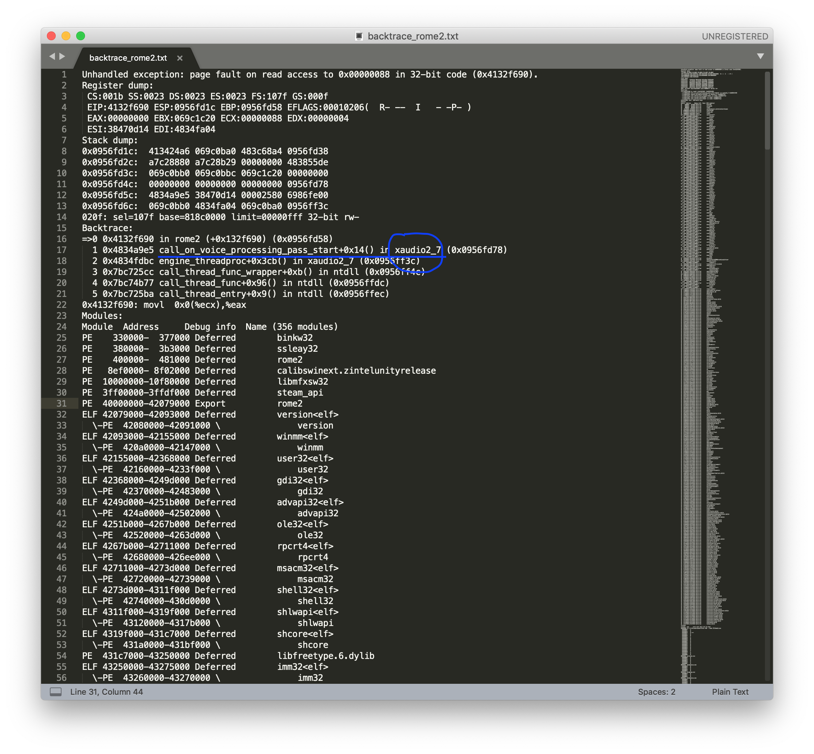

Lately, I've been spending quite a lot time at my friend's because he owns Total War Rome II, a very cool game.
{: .text-justify}

Suddenly, I remembered I had the DVD somewhere in my bookcase and after a bit of digging I found it.  Though, since I am a diehard mac user, I had no other choice than getting it to work on macOS with wine (plus the mac version is known to [suck](https://www.reddit.com/r/totalwar/comments/84h44y/rome_ii_on_mac/)).
{: .text-justify}

### Step 1 (may or may not be required for you)

If you are going to install it somewhere instead of your macOS installation disk just ***MAKE SURE*** the drive uses a filesystem different than FAT.  (It does not support files of size 4GB+ and installation will fail.)
{: .text-justify}

### Step 2 (patching)

Here comes the funny part. As of wine-devel-4.2 and (devel-4.3), rome2 crashes before the start screen (where SEGA, INTEL and CREATIVE ASSEMBLY logos are shown in a white luminous background.)
{: .text-justify}

What is more, this has been going on since I guess [this](http://wine.1045685.n8.nabble.com/PATCH-xaudio2-Use-assembly-wrapper-to-call-OnVoiceProcessingPassStart-callback-td5980759.html) happened.
{: .text-justify}

How do I know?

With a look in the backtrace one will notice the last function in the stack was `call_on_voice_processing_pass_start()` and was called from the `xaudio2_7` module. 
{: .text-justify}

A quick search online brought me to the link above, but what can we do now? Is there a patch available?
{: .text-justify}

I don't know, but, since this happened somewhere back in 2018 I figured that using a version of `xaudio2_7` prior to that date should make it work.
{: .text-justify}

(Supposedly, by reverting ***ONLY*** this patch and keeping everything as it is and building wine by yourself should give you the advantage of recent updates in xaudio and a working rome2 - but that was too much for me and my macbook.)
{: .text-justify}

I downloaded `xaudio2_7.dll.so` from wine-staging-2.5.
{: .text-justify}

I replaced the up-to-date version that shipped with wine-devel-4.2 with the one I downloaded from wine's repo and kept the `xaudio2_7.dll` that resides in system32 of your `.wine` (or whatever your WINEPREFIX is called) as it is.
{: .text-justify}

You can find the dll I used in [my dropbox](https://www.dropbox.com/s/13s4rl4lfnujazi/xaudio2_7.dll.so?dl=0) or download it for yourself from wine's binary repo if you don't trust a stranger.  (Just remember that staging-2.5 works.)
{: .text-justify}

That's all!
(The sound is kinda cranky but it's the best we have. Happy Roming.)
