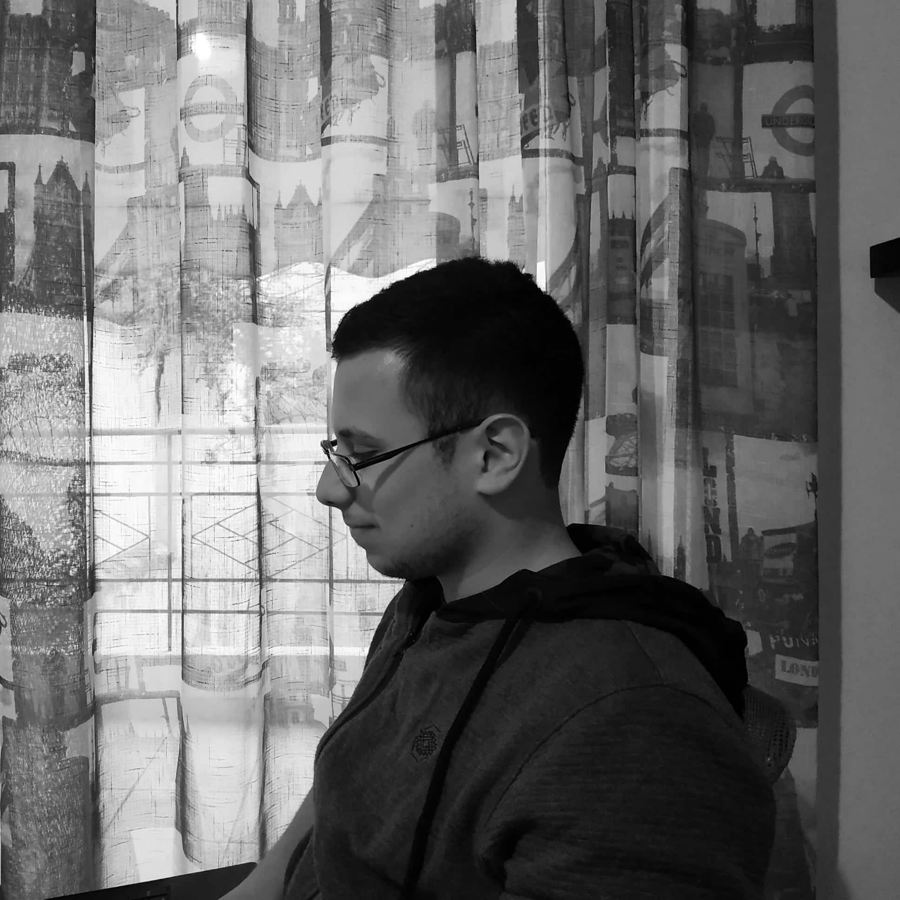

Hey !! 

I am Nick,
I am a student, pursuing a Computer Engineering Integrated Master at <a href="https://www.ceid.upatras.gr/">CEID</a>, University of Patras, Greece, and this is my CV:

## Programming Languages:
- C++ (university-taught level)
- Java (university-taught level)
- Objective-C (good level)
- ARM Assembly (good level) as part of University course Computer Architecture I
- Intel Assembly (ability to at-least read through personal study)

## Tools:
### IDEs:
- Visual Studio & Visual Studio Code
- IntelliJ's CLion & Idea
- Xcode
- Eclipse

### Other tools:
- GitHub & Git (Version-control)
- TravisCI (Continuous Integration)

## Experience:
- ported an opensource system monitor (conky) to macOS
  - involved good memory management techniques
  - learning about system internals and system APIs to access memory, cpu and disk statistics
  - strict testing with tools such as Xcode's Instruments
- creator of opensource project ManageConky (a widget manager for the conky system monitor)
  - involved managing and maintaining C/C++ code amongst with complex build systems (Makefiles/CMake)
- wrote a small tool for Windows called runnix that interfaced with WSL (a feature of Windows OS) back when there was WSL v1.0 :)
- with unix based/inspired systems such as GNU/Linux and macOS

- Contributed Backend code that manages users and their respective data (purchases list, product ratings and comments on products) for the macOS app MacForge using Google's Firebase SDK. This involved:
  - User Authentication mechanisms
  - Database Design & Management

- I maintain this blog, forked from a template but improved to my taste through time by me.

- Have played with CTF Challenges from <a style="color: green;" href="https://www.hackthebox.eu">Hack The Box</a> (Really enjoyed the Reverse Engineering ones; which made me eager to learn Intel Assembly, it being a mandatory condition!)

## Seminars Attended:
- Intracom Telecom's seminar regarding Telecommunications & more [Patras, Greece]

## Books I've Studied (amongst many others):
- C++ Primer, Fifth Edition, Addison Wesley
Effective C++, Third Edition, Scott Meyers, Addison Wesley

### Contact

<i>(Remove space between pylarinos and nick):</i> 
pylarinos nick AT gmail DOT com 
<a href="https://twitter.com/npyl_cheated?ref_src=twsrc%5Etfw" class="twitter-follow-button" data-show-count="false">Follow @npyl_cheated</a> 

 

### Donate / Support

 
 
 
 
